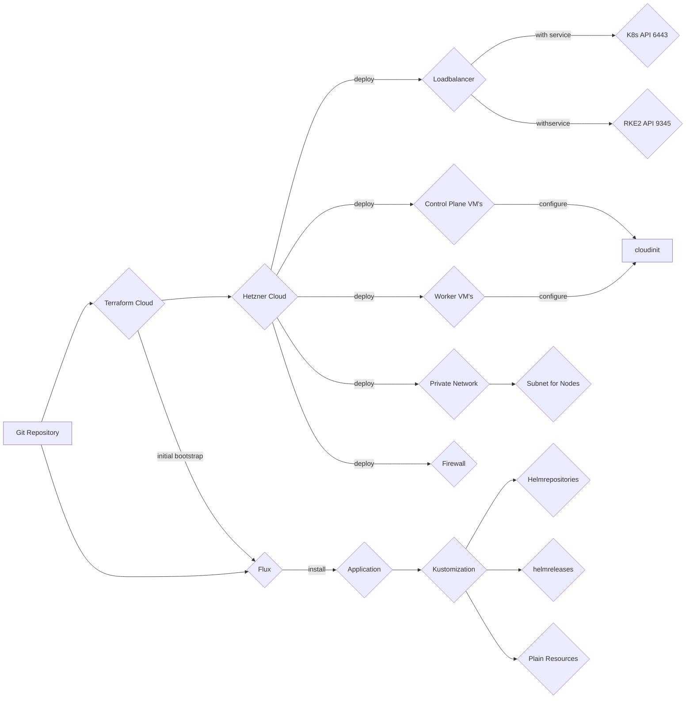

# infrastructure

IaC for acend kubernetes resources

This repo creates the basic acend infrastructure using terraform.

We use [Hetzner](https://www.hetzner.com/cloud) as our cloud provider and [RKE2](https://docs.rke2.io/) is used to create the kubernetes cluster.[Kubernetes Cloud Controller Manager for Hetzner Cloud](https://github.com/hetznercloud/hcloud-cloud-controller-manager) is used to provision l balancer from Kubernetes service (type `Loadbalancer`) objects and also configure the networking & native routing for the Kubernetes cluster network traffic.

[Flux](https://fluxcd.io/) is used to deploy resourcen on the Kubernetes Cluster

## Workflow

1. Terraform to deploy base infrastructure
   * VM's for controlplane and worker nodes
   * Network
   * Loadbalancer for Kubernetes API and RKE2
   * Firewall
   * Hetzner Cloud Controller Manager for the Kubernetes Cluster Networking
2. Terraform to delploy and bootstrap flux
3. Flux to deploy resources on the Kubernetes Cluster



### Operating System

We use Ubuntu 22.04 as our node operating system. Unattended-upgrade for automated security patching is enabled. If necessary, [kured](https://kured.dev/) will manage node reboots.

### Flux bootstrap & configuration

Terraform deploys the `GitRepository` resource pointing to this repository and one `Kustomization` resource which will deploy all resources in `deploy/bootstrap`. The `deploy/bootstrap` folder contains more `Kustomization` resources to deploy all our applications. An application can be deployed using plain Kubernetes resource files or from `HelmRepository` with a `HelmRelease`. See [Manage Helm Releases](https://fluxcd.io/flux/guides/helmreleases/) in the flux documentation. Currently most of our applications are deployed using a Helm chart.

## Applications

### Monitoring

The [kube-prometheus](https://github.com/prometheus-operator/kube-prometheus) stack is used for monitoring.

The montoring stack is deployed in the `monitoring` namespace.

As the `kube-scheduler`, `kube-controller-manager`, `etcd` only listens on `localhost` on the metrics port, [pushprox](https://github.com/prometheus-community/PushProx) is used to collect the metrics.

### Ingress Controller

The [NGINX Ingress Controller](https://kubernetes.github.io/ingress-nginx/) is used with a Hetzner LoadBalancer (automaticly deployed with a Kubernetes service of type `LoadBalancer`and the Hetzner Cloud Controller Manager).

The NGINX Ingress Controller is scaled to 2 replicas and spread on the worker nodes.

### Hetzner CSI

To provision storage we use [Hetzner CSI Driver](https://github.com/hetznercloud/csi-driver).

### Sealed Secrets

To keep Secrets safe in our Git Repository we use [sealed secrets](https://sealed-secrets.netlify.app/)

The StorageClass `hcloud-volumes` is set as default StorageClass

### Rancher System Upgrade Controller

For the Kubernetes Cluster upgrade we use the [Rancher System Upgrade Controller](https://github.com/rancher/system-upgrade-controller) which allows for automated rke2 upgrades.

Two plans are deployed:

* `server-plan` updates the `rke2` binary on the control-plane nodes
* `agent-plan` updates the `rke2` binary on the worker nodes after control-plane nodes are updated

For a cluster update, change the `version` field in both plans.

### kured

For safe automated node reboots we use [kured](https://kured.dev/)

When a reboot of a node is requered, `/var/run/reboot-required` is created by `unattended-upgrade`. Kured detects this and will safly reboot the node. Reboots are done everyday between 21:00 and 23:59:59 Europe/Zurich timezone. Befor rebooting, the node gets cordoned and drained and after the reboot uncordoned again. Only one node at the same time is rebooted.

### kyverno

[Kyverno](https://kyverno.io/) is deployed as a policy engine.

### rbac-manager

For easy ServiceAccount and RBAC Management the [rbac-manager](https://rbac-manager.docs.fairwinds.com/) is installed.

## Dependencies

* [Terraform](https://www.terraform.io/)
* [Flux](https://fluxcd.io/)

### Terraform provider & modules

* [Hetzner Cloud Provider](https://registry.terraform.io/providers/hetznercloud/hcloud/latest/docs)
* [kubernetes](https://registry.terraform.io/providers/hashicorp/kubernetes/latest)
* [helm](https://registry.terraform.io/providers/hashicorp/helm/latest)
* [tls](https://registry.terraform.io/providers/hashicorp/tls/latest)
* [SSH Terraform Provider](https://registry.terraform.io/providers/loafoe/ssh/latest)

## How to's

## Terraform usage

Login into terraform cloud with your account using:

```bash
terraform login
```

```bash
terraform init -backend-config=backend.hcl # only needed after initial checkout or when you add/change modules
terraform plan # to verify
terraform apply
```

### encrypt a secret

```bash
kubeseal --controller-name sealed-secrets -o yaml < secret.yaml > encrypted-secret.yaml
```

### upgrade Kubernetes version

1. Change version in the System Upgrade Controller plan in `deploy/system-upgrade-controller/plans/02-plans.yaml`
2. Change the Terraform variable `rke2_version` to match with the newly deployed version.

### Backup sealed-secret controller keys

From [How can I do a backup of my SealedSecrets?](https://github.com/bitnami-labs/sealed-secrets#how-can-i-do-a-backup-of-my-sealedsecrets):

If you do want to make a backup of the encryption private keys, it's easy to do from an account with suitable access:

```bash
kubectl get secret -n kube-system -l sealedsecrets.bitnami.com/sealed-secrets-key -o yaml >main.key
```

To restore from a backup after some disaster, just put that secrets back before starting the controller - or if the controller was already started, replace the newly-created secrets and restart the controller:

```bash
kubectl apply -f main.key
kubectl delete pod -n kube-system -l name=sealed-secrets-controller
```
