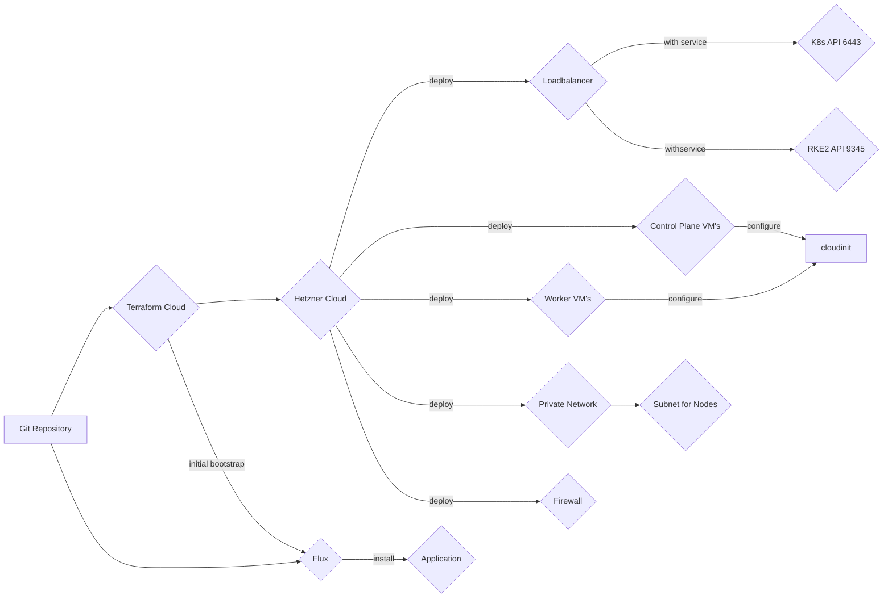

# infrastructure
IaC for acend kubernetes resources

This repo creates the basic acend infrastructure using terraform.

We use [Hetzner](https://www.hetzner.com/cloud) as our cloud provider and [RKE2](https://docs.rke2.io/) is used to create the kubernetes cluster.[Kubernetes Cloud Controller Manager for Hetzner Cloud](https://github.com/hetznercloud/hcloud-cloud-controller-manager) is used to provision Load Balancer from Kubernetes Service (Type Loadbalancer) objects and also configure the networking & native routing for the Kubernetes cluster network traffic.

[Flux](https://fluxcd.io/) is used to deploy resourcen on the Kubernetes Cluster

## Workflow

1. Terraform to deploy base infrastructure
   * VM's for controlplane and worker nodes
   * Network
   * Loadbalancer for Kubernetes API and RKE2
   * Firewall
   * Hetzner Cloud Controller Manager for the Kubernetes Cluster Networking
2. Terraform to delploy and bootstrap flux
3. Flux to deploy resources on the Kubernetes Cluster



### Operating System

We use Ubuntu 22.04 as our Node operating system. Unattended-upgrade for automated security patching is enabled. If necessary, kured will manage node reboots.
### Flux bootstrap & configuration

Terraform deploys the `GitRepository` resource pointing to this repository and one `Kustomization` resource which will deploy all resources in `deploy/bootstrap`. The `deploy/boottrap` folder contains all more `Kustomization` resources to deploy all our applications. An application can be deployed using plain kubernetes resource files or from `HelmRepository` with a `HelmRelease`. See [Manage Helm Releases](https://fluxcd.io/flux/guides/helmreleases/) in the flux documentation. Currently most of our applications are deployed using a Helm chart.

## Applications

### Monitoring

The [kube-prometheus](https://github.com/prometheus-operator/kube-prometheus) stack is used for monitoring.

### Ingress Controller

The [NGINX Ingress Controller](https://kubernetes.github.io/ingress-nginx/) is used with a Hetzner LoadBalancer (automaticly deployed with a Kubernetes Service of Type `LoadBalancer`and the Hetzner Cloud Controller Manager)

### Hetzner CSI

To provision storage we use  [Hetzner CSI Driver](https://github.com/hetznercloud/csi-driver).

### Sealed Secrets

To keep Secrets safe in our Git Repository we use [sealed secrets](https://sealed-secrets.netlify.app/)

### Rancher System Upgrade Controller

For the Kubernetes Cluster upgrade we use the [Rancher System Upgrade Controller](https://github.com/rancher/system-upgrade-controller) which allows for automated rke2 upgrades.

### kured

For safe automated node reboots we use [kured](https://kured.dev/)

### kyverno

[Kyverno](https://kyverno.io/) is deployed as a policy engine.

## Dependencies

* [Terraform](https://www.terraform.io/)
* [Flux](https://fluxcd.io/)

### Terraform provider & modules

* [Hetzner Cloud Provider](https://registry.terraform.io/providers/hetznercloud/hcloud/latest/docs)
* [kubernetes](https://registry.terraform.io/providers/hashicorp/kubernetes/latest)
* [helm](https://registry.terraform.io/providers/hashicorp/helm/latest)
* [tls](https://registry.terraform.io/providers/hashicorp/tls/latest)
* [SSH Terraform Provider](https://registry.terraform.io/providers/loafoe/ssh/latest)

## Terraform usage

Login into terraform cloud with your account using:

```bash
terraform login
```

```bash
terraform init -backend-config=backend.hcl # only needed after initial checkout or when you add/change modules
terraform plan # to verify
terraform apply
``
