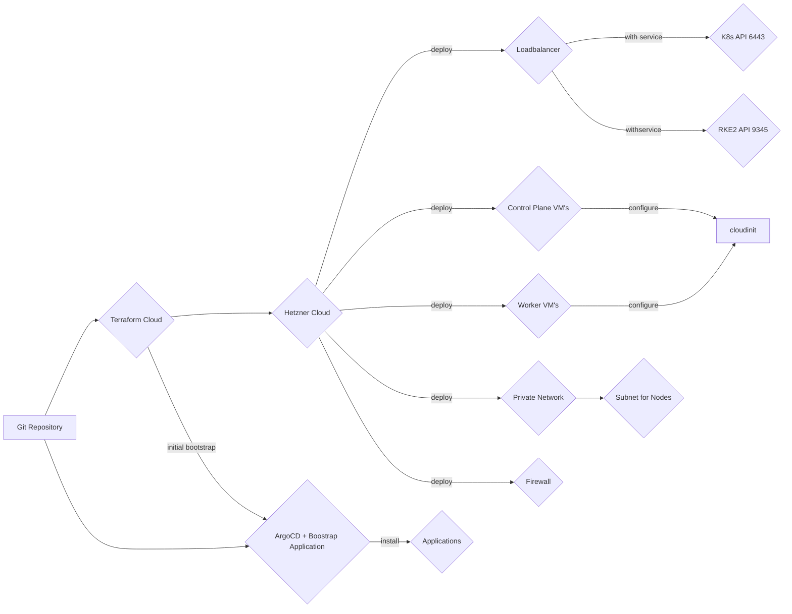

# infrastructure

IaC for acend kubernetes resources

This repo creates the basic acend infrastructure using Terraform and ArgoCD.

We use [Hetzner](https://www.hetzner.com/cloud) as our cloud provider and [RKE2](https://docs.rke2.io/) to create the kubernetes cluster.[Kubernetes Cloud Controller Manager for Hetzner Cloud](https://github.com/hetznercloud/hcloud-cloud-controller-manager) to provision lobalancer from a Kubernetes service (type `Loadbalancer`) objects and also configure the networking & native routing for the Kubernetes cluster network traffic.

[ArgoCD](https://argo-cd.readthedocs.io/en/stable/) is used to deploy resourcen on the Kubernetes Cluster

[Cluster Autoscaler](https://github.com/kubernetes/autoscaler/tree/master/cluster-autoscaler) is used to scale the Kubernetes Cluster beyond the initial minimal cluster size deployed by Terraform.

The minimal cluster size is set to 3 control plane nodes and 2 worker nodes.

Folder structure:

* `deploy`: Resources for ArgoCD application deployment
* `terraform`: All terraform files for infrastructure deployment

## Cluster Creation Workflow

In order to deploy our acend Kubernetes Cluster the following steps are necessary:

1. Terraform to deploy base infrastructure
   * VM's for controlplane and worker nodes
   * Network
   * Loadbalancer for Kubernetes API and RKE2
   * Firewall
   * Hetzner Cloud Controller Manager for the Kubernetes Cluster Networking
2. Terraform to deploy and bootstrap ArgoCD
3. ArgoCD to deploy resources on the Kubernetes Cluster
4. Cluster Autoscaler to scale the cluster beyond the minimal cluster size created with Terraform.



### Operating System

We use Ubuntu 22.04 as our node operating system. Unattended-upgrade for automated security patching is enabled. If necessary, [kured](https://kured.dev/) will manage node reboots.

### Cluster basic Design & Configuration and Setup Procedure

A RKE2 cluster has two types of nodes, a server node with the Kubernetes controlplan and a agent node only with the kubelet.

Our setup is based on the [High Availability](https://docs.rke2.io/install/ha) install instruction:

* RKE2 config files are initially generated with terrafrom and placed in `/etc/rancher/rke2/config.yaml` with cloudinit.
* Token is generated with Terraform (`resource "random_password" "rke2_cluster_secret"`)
* Cilium is used as the CNI Plugin and configured with the `HelmChartConfig` in `/var/lib/rancher/rke2/server/manifests/rke2-cilium-config.yaml`
* The Kubernetes cluster is kubeproxy free, the functionality is replaced with Cilium. See [Kubernetes Without kube-proxy](https://docs.cilium.io/en/v1.12/gettingstarted/kubeproxy-free/)
* Native Routing is used instead of a tunneling mechanism (e.g. vxlan). The [Kubernetes Cloud Controller Manager for Hetzner Cloud](https://github.com/hetznercloud/hcloud-cloud-controller-manager) is used to manage and provision the network setup (subnet & routing) for the cluster.
* Control plane nodes are tainted with `node-role.kubernetes.io/control-plane:true:NoSchedule`. Some of the applications (critical, infrastructure related are scheduled on control plane nodes)

#### tl;dr; Provision a Kubernetes Cluster with RKE2

See [Anatomy of a Next Generation Kubernetes Distribution](https://docs.rke2.io/architecture) for more details

1. Provision LoadBalancer for the Kubernetes API and the RKE2 Supervisor
2. Provision first controlplane node.
3. The RKE Supervisor listens on Port 9345/tcp for the other nodes to join the cluster
4. controlplane node 2 & 3 joins the cluster using the same token and they have set `server: https://${lb_address}:9345` in the config file to join the existing cluster.
5. Provision and join the agent nodes using the same token. They also have set `server: https://${lb_address}:9345` to join the existing cluster.
6. Scale cluster when needed using the cluster autoscaler.

### Terraform Configuration

Check [Install Terraform](https://developer.hashicorp.com/terraform/tutorials/aws-get-started/install-cli) for more details on how to use and install the cli.

#### Important variables

The following terraform variables are important:

Root:

* `clustername`: The name of the Kubernetes Cluster. This is used as label on the cloud resources for better identification.
* `controlplane_count`: The number of controlplane nodes Terraform deploys. This should always be set to `3`
* `worker_count`: The number of worker nodes Terraform deploys. This should be set to a minimum of `2`
* `k8s_api_hostnames`: A list of hostnames to be added to the Kubernetes API Certificate
* `extra_ssh_keys`: A list of extra SSH keys (besides the one generated in Terraform) to be deployed on the cluster nodes.
* `hcloud_api_token`: Hetzner API Token
* `hosttech_dns_token`: Hosttech API Token for DNS API
* `hosttech-dns-zone-id"`: Hosttech ZoneID in which DNS Entry for the k8s API LB are created
* `provider-*`: Initially the kubeconfig file is retreived from the first controlplane node and then used to deploy onto the cluster. You can use `provider-client-certificate`, `provider-cluster_ca_certificate`, `provider-client-key`, `provider-k8s-api-host` instead. Don't forget to change the `kubernetes` and `helm` provider in `terraform/modules/rke2-cluster/main.tf` if you wan't to.
  
modules/rke2-cluster (currently not set via root you can change defaults in `modules/rke2-cluster/variables.tf`)

* `location`: The Hetzner location where cloud resources are deployed. Defaults to `nbg1`
* `rke2_version`: the RKE2 version for initial node bootstraping.
* `networkzone`: the Hetzner network zone for the private network. Defaults to `eu-central`
* `lb_type`: Load Balancer Type for the K8S API and RKE2 API. Defaults to `lb11`
* `node_image_type`: The image type of all deployed vm's. Defaults to `ubuntu-22.04`
* `controlplane_type`: The node type for the control plane nodes. Defaults to `cpx31`
* `worker_type`: The node type for the worker nodes. Defaults to `cpx41`
* `cluster-domain`: the domain used in Ingress Resources e.g. for ArgoCD.

#### Terraform provider & modules

* [Hetzner Cloud Provider](https://registry.terraform.io/providers/hetznercloud/hcloud/latest/docs)
* [kubernetes](https://registry.terraform.io/providers/hashicorp/kubernetes/latest)
* [helm](https://registry.terraform.io/providers/hashicorp/helm/latest)
* [tls](https://registry.terraform.io/providers/hashicorp/tls/latest)
* [SSH Terraform Provider](https://registry.terraform.io/providers/loafoe/ssh/latest)
  
### ArgoCD bootstrap & Configuration

Terraform deploys a ArgoCD `Application` resource pointing to this repository which will deploy all resources from `deploy/bootstrap`. The `deploy/bootstrap` folder contains more ArgoCD `Applications` resources to deploy all our applications. An application can be deployed using plain Kubernetes resource files, from Kustomize or from Helm Charts. See [ArgoCD Documentation](https://argo-cd.readthedocs.io/en/stable/user-guide/application_sources/) for details.

Design decisions:

* We use [kustomize application](https://argo-cd.readthedocs.io/en/stable/user-guide/kustomize/). Each application folder in the `deploy` contains a `kustomization.yaml` defining all the resources that shall be deployed.
* Each application folder contains a `base` folder.
* Each application folder can include a `overlay` folder if needed (e.g. if this repo is deployed into multiple environments)
* For Helm Charts we also use [kustomize to generate YAML resources out of a Helm Chart](https://github.com/kubernetes-sigs/kustomize/blob/master/examples/chart.md)

### Cluster Access

For the moment, no external authentication provider is included (see https://github.com/acend/infrastructure/issues/11). We rely on ServiceAccounts and ServiceAccount JWT Tokens to authenticate. RKE2 provides a set of Admin Credentials on intial installation. All other ServiceAccounts and the JWT Tokens are created manually or using the rbac-manager.

See the [Create a new ServiceAccount with a JWT Token and `cluster-admin` privileges](#create-a-new-serviceaccount-with-a-jwt-token-and-cluster-admin-privileges) to create a new cluster access with `cluster-admin` privileges.

#### ci-bot Access

There is a Service Account with name `ci-bot` in Namespace `rbac-manager` wich can be used to deploy into the Cluster from a CICD System (e.g. Github Actions). The `ci-bot` has a Role Binding to the `edit` Cluster Role in all Namespaces where the label `ci-bot: true` is set.

There is a Kyverno `ClusterPolicy` with name `add-ci-bot-label-to-acend-ns` which automaticly adds the `ci-bot: true` Label to all Namespaces starting with `acend`.

## Applications

The following applications are deployed:

### Cert-Manager

Folder: `deploy/cert-manager`

[Cert Manager](https://cert-manager.io/) is used to issue Certificates (Let's Encrypt).
The [ACME Webhook for the hosttech DNS API](https://github.com/piccobit/cert-manager-webhook-hosttech) is used for `dns01` challenges with our DNS provider.

The following `ClusterIssuer` are available:

* `letsencrypt-prod`: for general http01 challenge.
* `letsencrypt-prod-dns01`: for dns01 challenge using the hosttech acme webhook.

All Cert-Manager components are scheduled on the control plane nodes.

### Cluster Autoscaler

Folder: `deploy/cluster-autoscaler`

The [Cluster Autoscaler](https://github.com/kubernetes/autoscaler/tree/master/cluster-autoscaler) with the [Hetzner Provider](https://github.com/kubernetes/autoscaler/blob/master/cluster-autoscaler/cloudprovider/hetzner/README.md) is used to automaticly scale the Kubernetes Cluster beyond the minimal cluster size of 3 control plane nodes and 2 Worker nodes.

The cluster autoscaler uses the same cloud-init file for the worker node as Terraform does. Terraform created a Secret on the cluster with the cloud init file that is used by the cluster autoscaler.

Currently there is one autoscaling group defined in the cluster autoscaler config (see `deploy/cluster-autoscaler/base/values.yaml`):

```yaml
autoscalingGroups:
  - name: CPX41:NBG1:acend-workerpool1
    maxSize: 2
    minSize: 0
```

This will deploy new nodes whenever needed (when there are `Pending` Pods) and also scales down again when possible. The `CPX41` node type is used and they are deployed in the `nbg1` zone of Hetzner (same as the initially deployed two worker with Terraform).
The two initially deployed worker nodes will never be removed and is part of the minimal cluster size.

For more details on how the Cluster Autoscaler works, see [FAQ](https://github.com/kubernetes/autoscaler/blob/master/cluster-autoscaler/FAQ.md).

The cluster autoscaler is scheduled on the control plane nodes.


### Hetzner CSI

Folder: none, directly from upstream repository

To provision storage we use [Hetzner CSI Driver](https://github.com/hetznercloud/csi-driver).

The StorageClass `hcloud-volumes` is set as default StorageClass.

The hetzner csi provider is scheduled on the control plane nodes.

### Monitoring

Folder: `deploy/kube-prometheus-stack`

The [kube-prometheus](https://github.com/prometheus-operator/kube-prometheus) stack is used for monitoring (Prometheus-Operator, Prometheus, Alertmanager, Grafana, Node-Exporter, kube-state-metrics).

The montoring stack is deployed in the `monitoring` namespace.

As the `kube-scheduler`, `kube-controller-manager`, `etcd` only listens on `localhost` on the metrics port, [pushprox](https://github.com/prometheus-community/PushProx) is used to collect the metrics.

Alertmanager is configured to send alerts to the #ops channel in our Slack workspace.

### kuberetes-replicator

Folder: `deploy/kubernetes-replicator`

The [Kubernetes Replicator](https://github.com/mittwald/kubernetes-replicator) is installed to sync Secrets (and ConfigMaps) between namespaces.

Example:

Push a Secret into other Namespaces by Namespace name:

```yaml
apiVersion: v1
kind: Secret
metadata:
  annotations:
    replicator.v1.mittwald.de/replicate-to: "my-ns-1,namespace-[0-9]*"
data:
  key1: <value>
```

Push a Secret into other Namespaces by Labels:

```yaml
apiVersion: v1
kind: Secret
metadata:
  annotations:
    replicator.v1.mittwald.de/replicate-to-matching: >
      my-label=value,my-other-label,my-other-label notin (foo,bar)
data:
  key1: <value>
```

The Kubernetes Replicator is scheduled on the control plane nodes.

### kured

Folder: `deploy/kured`

For safe automated node reboots we use [kured](https://kured.dev/)

When a reboot of a node is requered, `/var/run/reboot-required` is created by `unattended-upgrade`. Kured detects this and will safly reboot the node. Reboots are done everyday between 21:00 and 23:59:59 Europe/Zurich timezone. Befor rebooting, the node gets cordoned and drained and after the reboot uncordoned again. Only one node at the same time is rebooted.

### kyverno

Folder: `deploy/kyverno`

[Kyverno](https://kyverno.io/) is deployed as a policy engine.

Kyverno is scheduled on the control plane nodes.

### NGINX Ingress Controller

Folder: `deploy/nginx-ingress-controller`

The [NGINX Ingress Controller](https://kubernetes.github.io/ingress-nginx/) is used with a Hetzner LoadBalancer (automaticly deployed with a Kubernetes service of type `LoadBalancer`and the Hetzner Cloud Controller Manager).

The NGINX Ingress Controller is scaled to 2 replicas and spread on the worker nodes. Proxy Protocol is enabled, `load-balancer.hetzner.cloud/uses-proxyprotocol: true` Annotation on the Service and `use-proxy-protocol: true` in the controller ConfigMap. This allows for real Client-IP's.


### rbac-manager

Folder: `deploy/rbac-manager` & `deploy/rbac`

For easy ServiceAccount and RBAC Management the [rbac-manager](https://rbac-manager.docs.fairwinds.com/) is installed.

The RBAC manager scheduled on the control plane nodes.

### Sealed Secrets

Folder: `deploy/csealed-secrets`

To keep Secrets safe in our Git Repository we use [sealed secrets](https://sealed-secrets.netlify.app/)

For examples on how to use see [How To's / Encrypt a Secret](#encrypt-a-secret)

Sealed Secrets is scheduled on the control plane nodes.

### System Upgrade Controller

Folder: `deploy/system-upgrade-controller`

For the Kubernetes Cluster upgrade we use the [Rancher System Upgrade Controller](https://github.com/rancher/system-upgrade-controller) which allows for automated rke2 upgrades.

Two plans are deployed:

* `server-plan` updates the `rke2` binary on the control-plane nodes
* `agent-plan` updates the `rke2` binary on the worker nodes after control-plane nodes are updated

The System Upgrade Controller is scheduled on the control plane nodes.

## Acend configuration

Folder: `deploy/acend`

For the acend related resources there is an `acend` ArgoCD Application. The application does:

* Deploy acend Namespaces (in which Github can deploy resources)
* Acend Certificates (e.g. our `*.training.acend.ch` wildcard certificate shared in all `acend-*` Namespaces)

## How to's

## Terraform usage

Login into Terraform cloud with your account using:

```bash
terraform login
```

```bash
terraform init -backend-config=backend.hcl # only needed after initial checkout or when you add/change modules
terraform plan # to verify
```

As we use Terraform cloud, a `terraform apply` cannot be executed locally. You have to commit/push your changes and then let Terraform cloud execute the run.

### encrypt a secret

Examples:

```bash
kubeseal --controller-name sealed-secrets -o yaml < secret.yaml > encrypted-secret.yaml
```

```bash
kubectl -n monitoring create secret generic github-client --from-literal=GF_AUTH_GITHUB_CLIENT_ID="xyz" --from-literal=GF_AUTH_GITHUB_CLIENT_SECRET="xyz" --dry-run=client -o yaml > github-client.yaml
kubeseal --format yaml --controller-name sealed-secrets <github-client.yaml >sealed-github-client.yaml
```

### upgrade Kubernetes version

1. Change version in the System Upgrade Controller plans (`server-plan` & `agent-plan`) in `deploy/system-upgrade-controller/base/plans.yaml`
2. Change the Terraform variable `rke2_version` to match with the newly deployed version.

### Backup sealed-secret controller keys

From [How can I do a backup of my SealedSecrets?](https://github.com/bitnami-labs/sealed-secrets#how-can-i-do-a-backup-of-my-sealedsecrets):

If you do want to make a backup of the encryption private keys, it's easy to do from an account with suitable access:

```bash
kubectl get secret -n kube-system -l sealedsecrets.bitnami.com/sealed-secrets-key -o yaml >main.key
```

To restore from a backup after some disaster, just put that secrets back before starting the controller - or if the controller was already started, replace the newly-created secrets and restart the controller:

```bash
kubectl apply -f main.key
kubectl delete pod -n kube-system -l name=sealed-secrets-controller
```

### Change RKE2 configuration after initial bootstrap

The rke2 configuration is in `/etc/rancher/rke2/config.yaml` and was initially generated with terraform and deployed using cloud-init. Terraform does not change this anymore after initial node setup. Therefore you have to manually change (or recreate the node). After a change run `systemctl restark rke2-server`. On the agent nodes, run `systemctl restart rke2-agent`. You have to change the settings on all nodes.

### Change Cilium configuration

The Cilium Helm values are in `/var/lib/rancher/rke2/server/manifests/rke2-cilium-config.yaml` on the server nodes. You have to change it on all nodes. Afterwards RKE2 automatically reconfigure cilium.
RKE2 uses a Cilium version bundled in the [rke2-cilium](https://github.com/rancher/rke2-charts/blob/main/charts/rke2-cilium/rke2-cilium) Helm chart from RKE2. The used version is shown in the [RKE2](https://github.com/rancher/rke2/releases/) release notes.

### Observe network traffic with hubble and the hubble-ui

Hubble is the observability toolof the Cilium CNI. Hubble UI is a WebUI for hubble to observe network flows.

To acess the Hubble UI you have to forward the `hubble-ui` service with:

```bash
kubectl -n kube-system port-forward svc/hubble-ui 8080:80
```

and then you can open [http://locahhost:8080](http://locahhost:8080) in your browser.

You can also install the hubble cli locally by downloading the correct binary from the [Github Release](https://github.com/cilium/hubble/releases) page.

To use the hubble cli you have to forward the `hubble-relay` service with:

```bash
kubectl -n kube-system port-forward svc/hubble-relay 4245:80
```

and then you can use the `hubble` cli locally. Check `hubble -h` for details on how to use it.

### Create a new ServiceAccount with a JWT Token and `cluster-admin` privileges

Extend the RBACDefinition in `deploy/rbac/cluster-admin.yaml` and add a new `subject` to the `cluster-admin` `roleBindings`. As Kubernetes version >= 1.26 does not automaticly create a ServiceAccount Token (see [Kubernetes documentation](https://kubernetes.io/docs/tasks/configure-pod-container/configure-service-account/#manually-create-an-api-token-for-a-serviceaccount)), you also have to add the `Secret` with the `kubernetes.io/service-account.name` Annotation. Check `deploy/rbac/cluster-admin.yaml` for examples.

Then you need someone who has already access to the cluster to get the Service Account token. You can obtain the token and create a kubeconfig file with:

```bash
# executed by someone with Access to the cluster
USERNAME=<username>
IPK8SAPI=<K8S Load Balancer IP or Hostname>
TOKEN=$(kubectl -n rbac-manager get secret $USERNAME -o jsonpath={.data.token} | base64 -d)
kubectl -n rbac-manager get secret $USERNAME -o jsonpath={.data.'ca\.crt'} | base64 -d > ca.crt
export KUBECONFIG=./kubeconfig.yaml
kubectl config set-credentials $USERNAME --token=$TOKEN
kubectl config set-cluster acend-infra --certificate-authority=./ca.crt --embed-certs=true --server https://$IPK8SAPI:6443
kubectl config set-context acend --cluster acend-infra --user $USERNAME
kubectl config use-context acend
unset KUBECONFIG
cat ./kubeconfig.yaml
```

### Get ArgoCD admin credentials

Run the following command in the `terraform` subfolder to get the `admin` password for ArgoCD:

```bash
terraform output argocd-admin-secret
```

### Get rke2 admin kubeconfig

Run the following command in the `terraform` subfolder to get the kubeconfig file for the admin user created by RKE2:

```bash
terraform output -raw kubeconfig_raw > kubeconfig.yaml
```

### Access Prometheus and Alertmanager UI

The Prometheus and Alertmanager UI are not exposed via Ingress Resource. You have to port-forward the services and access it via `localhost`.

Prometheus:

```bash
kubectl -n monitoring port-forward svc/kube-prometheus-stack-prometheus 9090
```

and then open [http://localhost:9090](http://localhost:9090)

Alertmanager:

```bash
kubectl -n monitoring port-forward svc/kube-prometheus-stack-alertmanager 9093
```

and then open [http://localhost:9093](http://localhost:9093)

### Access ArgoCD when no ingress controller is available

In case where no ingress controller is available, you can still access ArgoCD using a port-forward:

```bash
kubectl -n argocd port-forward svc/argocd-server 8443:443
```

and then you can use the `argocd` cli with and the admin credentials:

```bash
argocd login localhost:8443
```
