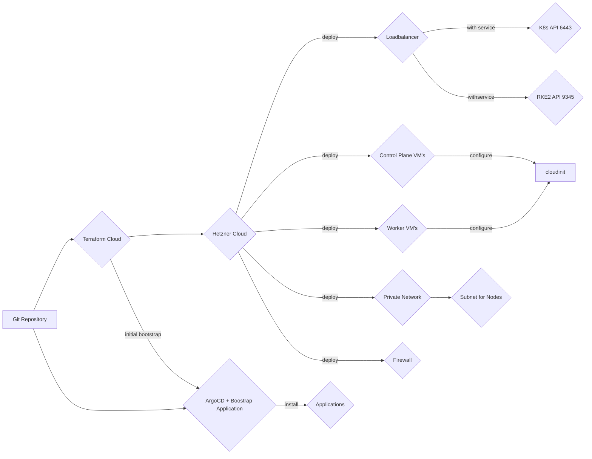

# acend infrastructure

IaC for acend kubernetes resources

This repo creates the basic acend infrastructure using Terraform and ArgoCD.

We use [Hetzner](https://www.hetzner.com/cloud) as our cloud provider and [RKE2](https://docs.rke2.io/) to create the kubernetes cluster. [Kubernetes Cloud Controller Manager for Hetzner Cloud](https://github.com/hetznercloud/hcloud-cloud-controller-manager) to provision lobalancer from a Kubernetes service (type `Loadbalancer`) objects and also configure the networking & native routing for the Kubernetes cluster network traffic.

[ArgoCD](https://argo-cd.readthedocs.io/en/stable/) is used to deploy resourcen on the Kubernetes Cluster

[Cluster Autoscaler](https://github.com/kubernetes/autoscaler/tree/master/cluster-autoscaler) is used to scale the Kubernetes Cluster beyond the initial minimal cluster size deployed by Terraform.

The minimal cluster size is set to 3 control plane nodes and 2 worker nodes.

Folder structure:

* `deploy`: Resources for ArgoCD application deployment
* `terraform`: All terraform files for infrastructure deployment

## Cluster Creation Workflow

In order to deploy our acend Kubernetes Cluster the following steps are necessary:

1. Terraform to deploy base infrastructure
   * VM's for controlplane and worker nodes
   * Network
   * Loadbalancer for Kubernetes API and RKE2
   * Firewall
   * Hetzner Cloud Controller Manager for the Kubernetes Cluster Networking
2. Terraform to deploy and bootstrap ArgoCD
3. ArgoCD to deploy resources on the Kubernetes Cluster
4. Cluster Autoscaler to scale the cluster beyond the minimal cluster size created with Terraform.

### Operating System

We use Ubuntu 22.04 as our node operating system. Unattended-upgrade for automated security patching is enabled. If necessary, [kured](https://kured.dev/) will manage node reboots.

### Cluster basic Design & Configuration and Setup Procedure

A RKE2 cluster has two types of nodes, a server node with the Kubernetes controlplan and a agent node only with the kubelet.

Our setup is based on the [High Availability](https://docs.rke2.io/install/ha) install instruction:

* RKE2 config files are initially generated with terrafrom and placed in `/etc/rancher/rke2/config.yaml` with cloudinit.
* Token is generated with Terraform (`resource "random_password" "rke2_cluster_secret"`)
* Cilium is used as the CNI Plugin and configured with the `HelmChartConfig` in `/var/lib/rancher/rke2/server/manifests/rke2-cilium-config.yaml`
* The Kubernetes cluster is kubeproxy free, the functionality is replaced with Cilium. See [Kubernetes Without kube-proxy](https://docs.cilium.io/en/v1.12/gettingstarted/kubeproxy-free/)
* Native Routing is used instead of a tunneling mechanism (e.g. vxlan). The [Kubernetes Cloud Controller Manager for Hetzner Cloud](https://github.com/hetznercloud/hcloud-cloud-controller-manager) is used to manage and provision the network setup (subnet & routing) for the cluster.
* Control plane nodes are tainted with `node-role.kubernetes.io/control-plane:true:NoSchedule`. Some of the applications (critical, infrastructure related are scheduled on control plane nodes)

#### tl;dr; Provision a Kubernetes Cluster with RKE2

See [Anatomy of a Next Generation Kubernetes Distribution](https://docs.rke2.io/architecture) for more details

1. Provision LoadBalancer for the Kubernetes API and the RKE2 Supervisor
2. Provision first controlplane node.
3. The RKE Supervisor listens on Port 9345/tcp for the other nodes to join the cluster
4. controlplane node 2 & 3 joins the cluster using the same token and they have set `server: https://${lb_address}:9345` in the config file to join the existing cluster.
5. Provision and join the agent nodes using the same token. They also have set `server: https://${lb_address}:9345` to join the existing cluster.
6. Scale cluster when needed using the cluster autoscaler.

### Terraform Configuration

Check [Install Terraform](https://developer.hashicorp.com/terraform/tutorials/aws-get-started/install-cli) for more details on how to use and install the cli.

[Terraform Cloud](https://app.terraform.io) is used for execution of Terraform runs and remote state storage. All secrets required to bootstrap the infrastructure are also stored in Terraform Cloud.

#### Important variables

The following terraform variables are important:

Root:

* `clustername`: The name of the Kubernetes Cluster. This is used as label on the cloud resources for better identification.
* `controlplane_count`: The number of controlplane nodes Terraform deploys. This should always be set to `3`
* `worker_count`: The number of worker nodes Terraform deploys. This should be set to a minimum of `2`
* `k8s_api_hostnames`: A list of hostnames to be added to the Kubernetes API Certificate
* `extra_ssh_keys`: A list of extra SSH keys (besides the one generated in Terraform) to be deployed on the cluster nodes.
* `hcloud_api_token`: Hetzner API Token
* `hosttech_dns_token`: Hosttech API Token for DNS API
* `hosttech-dns-zone-id"`: Hosttech ZoneID in which DNS Entry for the k8s API LB are created
* `provider-*`: Initially the kubeconfig file is retreived from the first controlplane node and then used to deploy onto the cluster. You can use `provider-client-certificate`, `provider-cluster_ca_certificate`, `provider-client-key`, `provider-k8s-api-host` instead. Don't forget to change the `kubernetes` and `helm` provider in `terraform/modules/rke2-cluster/main.tf` if you wan't to.
* `first_install`:  set this to `true` if its the very first installation. RKE2 requires the very first control plane node to handle special. And also the DNS Records for the Ingress Controller LoadBalancer is only available after ArgoCD has installed the Ingress Contoller. Defaults to `false`
* `github-app-argocd-clientSecret`: Client Secret for the GitHub Oauth App used in ArgoCD for authentication
  
modules/rke2-cluster (currently not set via root you can change defaults in `modules/rke2-cluster/variables.tf`)

* `location`: The Hetzner location where cloud resources are deployed. Defaults to `nbg1`
* `rke2_version`: the RKE2 version for initial node bootstraping.
* `networkzone`: the Hetzner network zone for the private network. Defaults to `eu-central`
* `lb_type`: Load Balancer Type for the K8S API and RKE2 API. Defaults to `lb11`
* `node_image_type`: The image type of all deployed vm's. Defaults to `ubuntu-22.04`
* `controlplane_type`: The node type for the control plane nodes. Defaults to `cpx31`
* `worker_type`: The node type for the worker nodes. Defaults to `cpx41`
* `cluster-domain`: the domain used in Ingress Resources e.g. for ArgoCD.

### ArgoCD bootstrap & Configuration

Terraform deploys a ArgoCD `Application` resource pointing to this repository which will deploy all resources from `deploy/bootstrap`. The `deploy/bootstrap` folder contains more ArgoCD `Applications` resources to deploy all our applications. An application can be deployed using plain Kubernetes resource files, from Kustomize or from Helm Charts. See [ArgoCD Documentation](https://argo-cd.readthedocs.io/en/stable/user-guide/application_sources/) for details.

Design decisions:

* We follow the [App of Apps Pattern](https://argo-cd.readthedocs.io/en/stable/operator-manual/cluster-bootstrapping/)
* We use [kustomize application](https://argo-cd.readthedocs.io/en/stable/user-guide/kustomize/). Each application folder in the `deploy` contains a `kustomization.yaml` defining all the resources that shall be deployed.
* Each application folder contains a `base` folder.
* Each application folder can include a `overlay` folder if needed (e.g. if this repo is deployed into multiple environments)
* For Helm Charts we also use [kustomize to generate YAML resources out of a Helm Chart](https://github.com/kubernetes-sigs/kustomize/blob/master/examples/chart.md)

### Cluster Access

For the moment, no external authentication provider is included (see https://github.com/acend/infrastructure/issues/11). We rely on ServiceAccounts and ServiceAccount JWT Tokens to authenticate. RKE2 provides a set of Admin Credentials on intial installation. All other ServiceAccounts and the JWT Tokens are created manually or using the rbac-manager.

See the [Create a new ServiceAccount with a JWT Token and `cluster-admin` privileges](howto.md#create-a-new-serviceaccount-with-a-jwt-token-and-cluster-admin-privileges) to create a new cluster access with `cluster-admin` privileges.

#### ci-bot Access

There is a Service Account with name `ci-bot` in Namespace `rbac-manager` wich can be used to deploy into the Cluster from a CICD System (e.g. Github Actions). The `ci-bot` has a Role Binding to the `edit` Cluster Role in all Namespaces where the label `ci-bot: true` is set.

There is a Kyverno `ClusterPolicy` with name `add-ci-bot-label-to-acend-ns` which automaticly adds the `ci-bot: true` Label to all Namespaces starting with `acend`.

### Hetzner Cloud Console

The Hetzner Cloud Console can be accessed via [Hetzner Cloud Console](https://console.hetzner.cloud/). All provisioned resources are assigned to projects. We have the following projects:

* [acend infrastructure](https://console.hetzner.cloud/projects/2003186/servers)

Access, API tokens are assigned to projects.

To get access, ask an existing project member to create a new invitation.

## Applications

See [Applications](applications.md)

## How to

See [How to](howto.md)

## Troubleshooting

See [Troubleshooting](troubleshooting.md)
